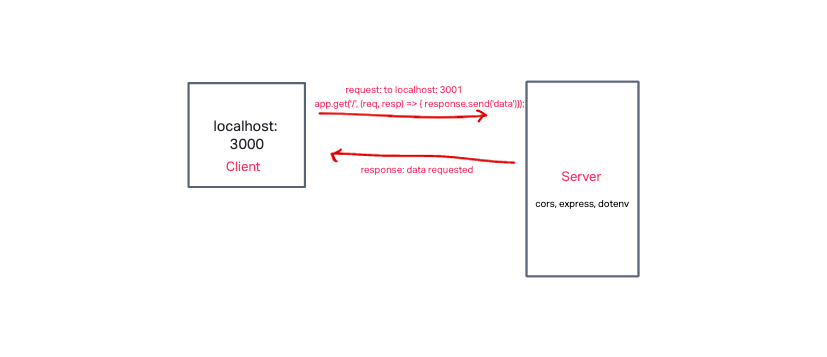
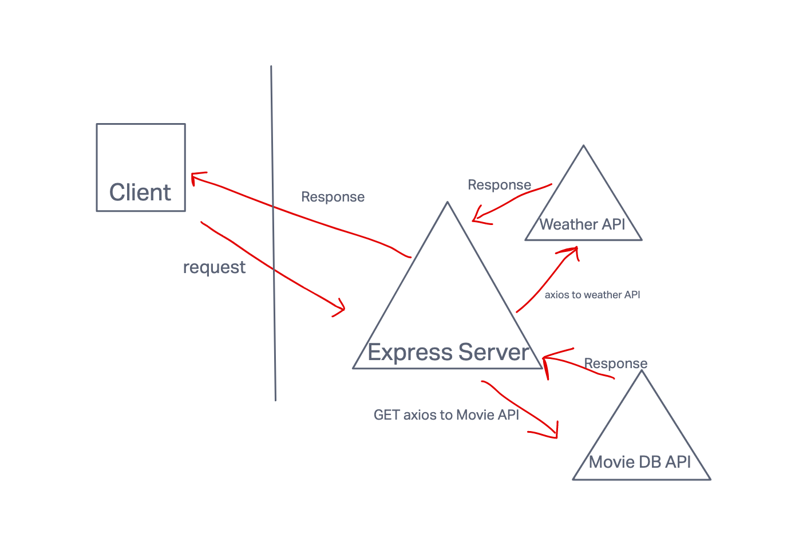

# City Explorer API

**Author**: Katharine Swilley
**Version**: 1.0.0

## Overview

## Getting Started

## Architecture

## Change Log

## Credit and Collaboration

* Cody Davis collaborated on wireframe

## Time Estimates:

### **Lab 7 - Task 1: Set up your server repository**

Estimate of time needed to complete: 30 minutes

Start time: 3:30pm

Finish time: 4:00pm

Actual time needed to complete: 30 minutes

### **Lab 7 - Task 2: Weather**

Estimate of time needed to complete: 2 hours

Start time: 4:30pm

Finish time: 6:45 pm (next day)

Actual time needed to complete: too long

;